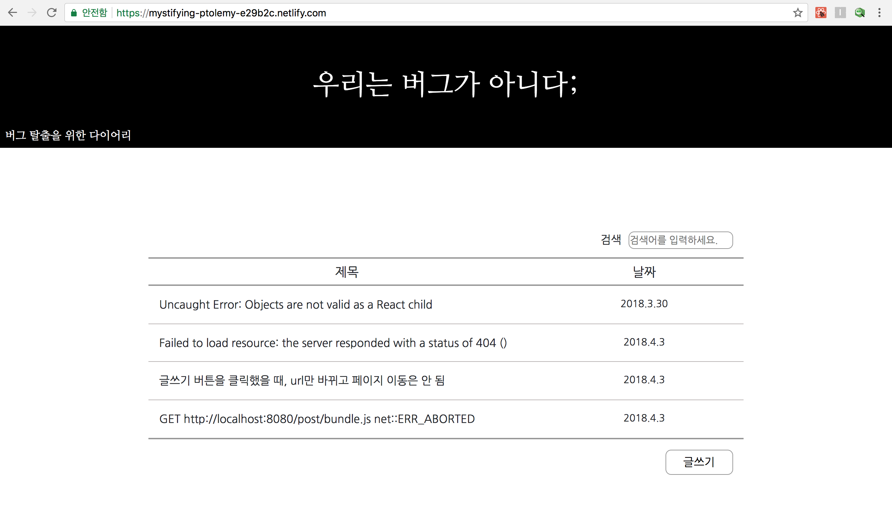
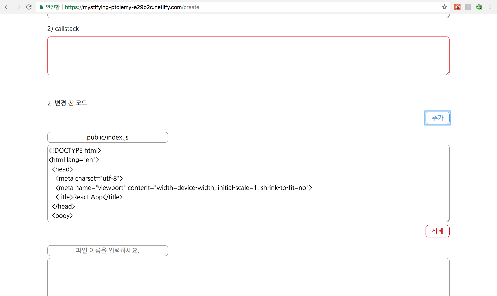
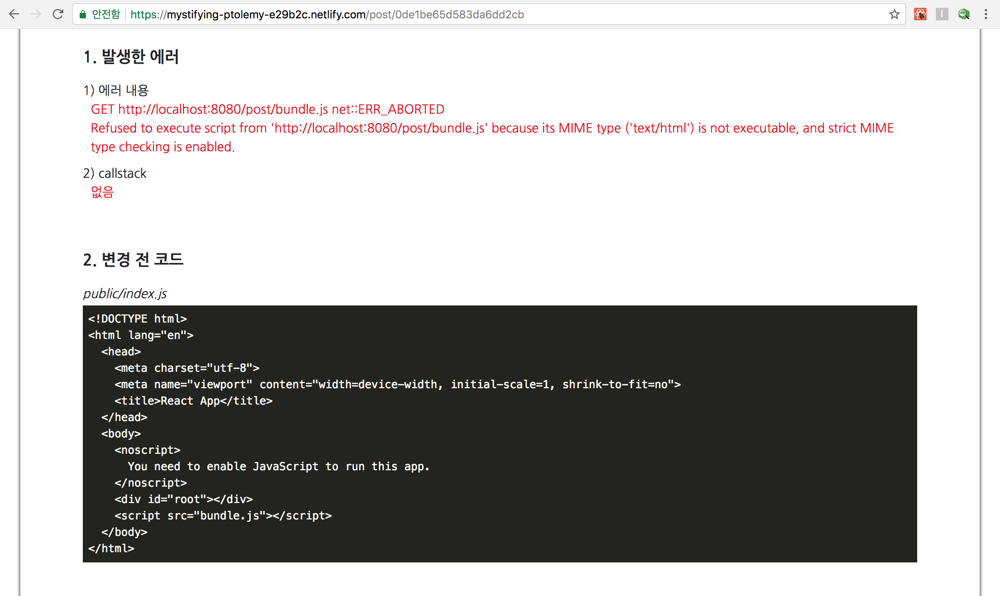
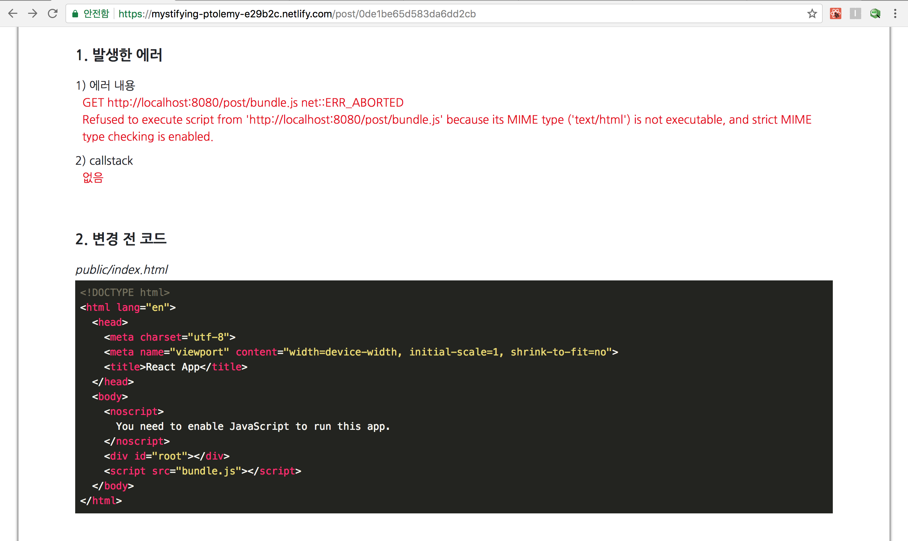
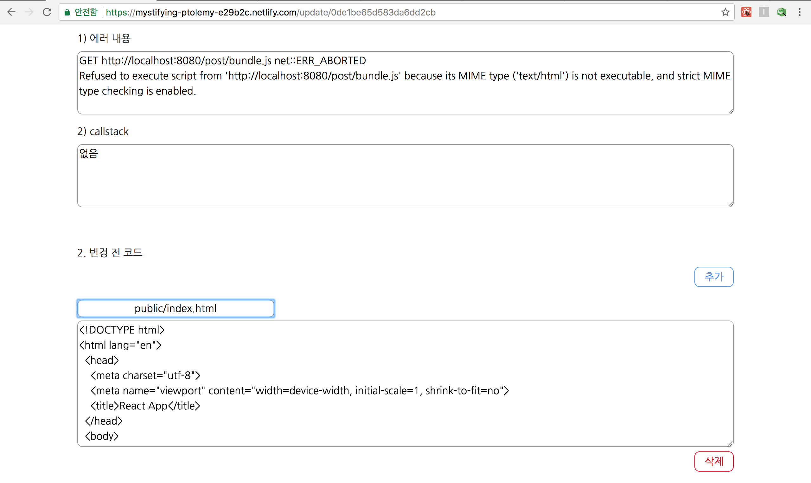
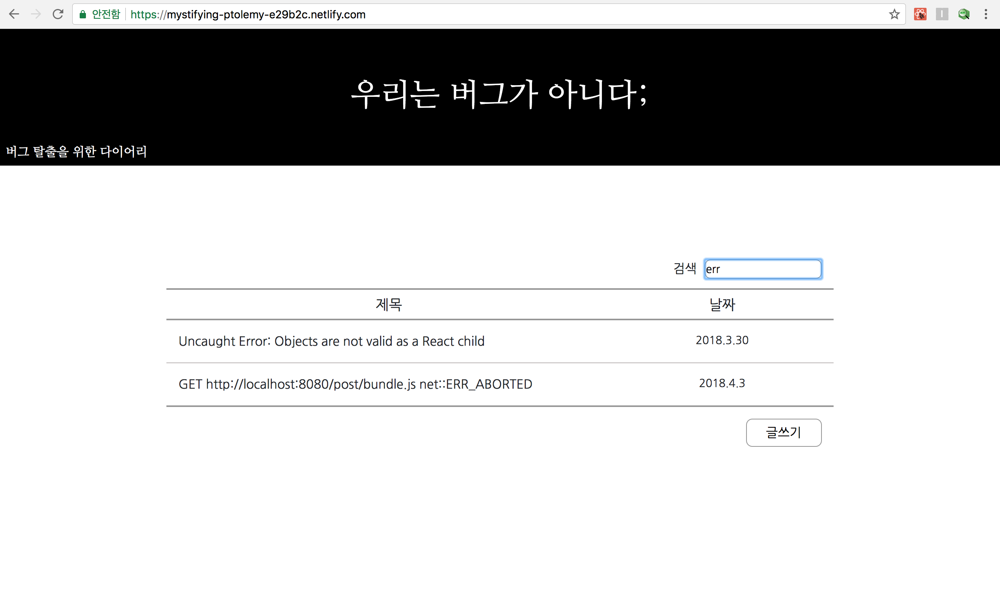
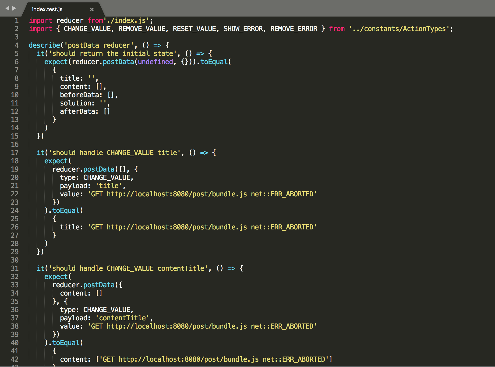
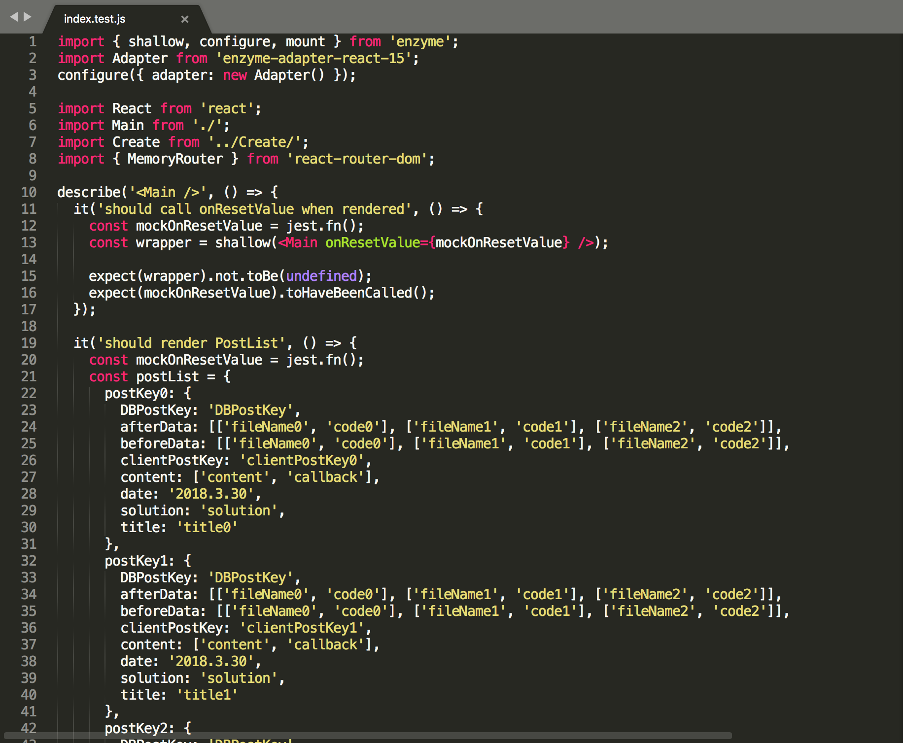
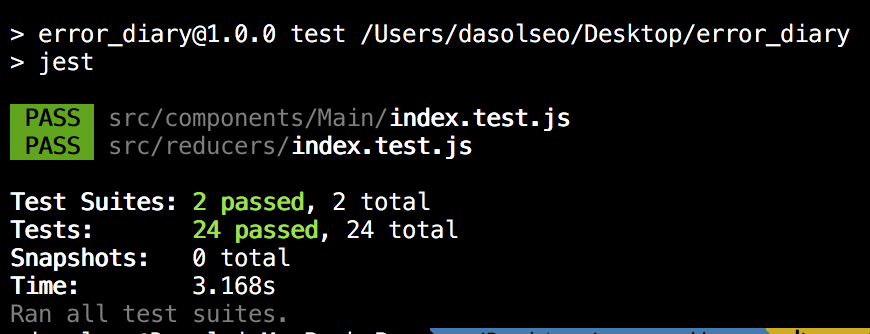

## Error Diary

## Contents

- [Usage](#usage)
  - [Requirements](#requirements)
  - [Introduction](#introduction)
  - [Motivation](#motivation)
  - [Installation](#installation)
  - [Features](#features)
- [Development](#development)
  - [Client-Side](#client-side)
  - [Server-Side](#server-side)
  - [Challenges](#challenges)
  - [Test](#test)
  - [Deployment](#deployment)
  - [Things to do](#things-to-do)

## Usage
### Requirements

- Chrome Browser를 권장합니다.

### Introduction

Error Diary는 코딩을 하면서 만난 에러들을 코드와 함께 기록해 언제든지 찾아볼 수 있는 다이어리 어플리케이션입니다.


### Motivation

지금까지 코딩을 하면서 많은 에러들을 만났고, 해결해왔는데 그 중에는 이전에 만났던 에러와 똑같은 에러가 발생할 때도 있었습니다.
하지만 에러를 만날 때마다 그에 대한 해결방법을 항상 기억하고 있는 것은 아닙니다.
그렇기 때문에 그때마다 구글링을 통해 해결해왔고, 그 과정이 비효율적이라는 생각이 들었습니다.
그래서 에러를 만날 때마다 에러의 내용과 해결방법을 코드로 작성해 모아두면 좋지 않을까라는 생각을 하게 되었고, 그 결과 Error Diary를 만들게 되었습니다.

### Installation
```
git clone https://github.com/dasol-seo/error_diary.git
cd error_diary
npm install
npm start
```

### Features

- 작성하기:
메인 페이지에서 글쓰기 버튼을 누르면 글을 작성할 수 있는 페이지로 이동하게 됩니다. 
만약 제목 포함 5가지 항목 중 한 가지라도 작성하지 않게 되면 에러 표시 또는 에러 메시지가 나타납니다.
변경 전 코드 아래 추가 버튼을 누르게 되면 파일이름과 코드를 작성할 수 있는 필드가 나타나고, 동시에 변경 후 코드에도 같은 폼의 필드가 나타납니다.


  - 저장하기: 저장이 완료되면 작성한 글을 볼 수 있는 페이지로 이동합니다. 
  - 취소하기: 글 목록을 볼 수 있는 메인 페이지로 이동합니다.

- 작성한 글 보기:
작성하거나 수정한 글을 볼 수 있는 페이지입니다.
변경 전 코드, 변경 후 코드는 markdown 방식을 적용해 editor에서 코드를 작성할 때 모습과 똑같이 보여지게 됩니다.



  - 수정하기:
  원하는 글을 선택한 후 수정하기 버튼을 누르면 글을 수정할 수 있는 페이지로 이동하게 되고, 원하는 항목을 선택해 내용을 수정할 수 있습니다.
  
    - 수정하기: 수정한 결과가 글에 반영됩니다.
    - 취소하기: 글 목록을 볼 수 있는 메인 페이지로 이동합니다.

  - 삭제하기: 해당 글을 삭제한 후 글 목록을 볼 수 있는 메인 페이지로 이동합니다.
  - 목록보기: 글 목록을 볼 수 있는 메인 페이지로 이동합니다.

- 검색하기:
검색창에 검색어를 입력하면 따로 Enter키를 누르지 않아도 자동으로 글을 찾아줍니다. 영어는 대소문자 관계없이 검색이 가능합니다.


## Development
### Repo Organization

- Client-side
  - public
      - fonts: 프로젝트에 사용되는 폰트들이 저장되어 있는 폴더입니다.
      - bundle.js: webpack이 실행되면 자동으로 업데이트되는 파일입니다.
      - index.html: Client의 시작점입니다.
  - screenshots: README.md에 사용되는 screenshot 이미지들이 저장되어 있는 폴더입니다.
  - src
      - actions: Redux actions
      - components: 정보를 보여주는 것을 담당하는 컴포넌트들을 모아둔 폴더이며, 각각의 하위 폴더 안에는 js파일과 style파일이 함께 저장되어 있습니다.
          - App: 페이지의 header부분과 밑의 4개의 컴포넌트를 모아둔 부모 컴포넌트입니다. containers와 연결되어 있으며, containers에서 내려주는 정보들을 사용할 수 있습니다.
          - Create: 글을 처음 작성할 때 볼 수 있는 컴포넌트입니다.
          - Main: 글 목록을 보여주는 컴포넌트입니다.
          - Post: 작성한 글을 볼 수 있는 컴포넌트입니다.
          - Update: 글을 수정할 때 볼 수 있는 컴포넌트입니다.
      - constants: 사용자들의 특정 행동을 문자열로 나타내 저장해놓은 폴더입니다.
      - containers: Redux containers
      - reducers: Redux reducers, test file
  - index.js: firebase, Redux store, React-router에 대한 내용이 포함되어 있는 파일입니다.
  - utils.js: 유틸 함수들을 모아둔 파일입니다.

### Client-Side

- Babel을 통한 모던 자바스크립트(ES2015+)
- Redux 라이브러리를 사용한 Flux 아키텍처 기반 설계
- React, Webpack, CSS Modules을 사용한 컴포넌트 베이스 UI 아키텍처 구현
- React Hot Loader 플러그인을 사용, 프런트 개발 환경 간편화
- CSS Preprocessor는 Less, CSS Framework는 Boostrap을 사용

### Server-Side

- Firebase Realtime Database 사용

### Challenges 

- 팀원들과 협력하면서 서비스가 완성되어가는 것에 대한 기쁨을 함께 나누지 못하고 혼자 고독하게 개발한 것
- 페이지 이동을 client에서 다루게 되면서 신경써야 되는 부분이 생김
    - 버튼을 누르거나 새로고침을 했을 때 url에 맞는 페이지가 보이게 하는 것
    - 페이지 이동을 할 때 이전 페이지에서 입력된 정보들을 초기화시켜야 하는 것
- component입장에서 state, props이름을 무의식적으로 짓는 것

### Test

테스트 엔진은 Jest를 사용했으며, reducer와 Main컴포넌트 테스트를 진행했습니다.

- reducers/index.test.js


- components/Main/index.test.js


- 테스트 결과


### Deployment

- netlify

### Version Control

- Github 사용
- Branch, Pull Request 기반 개발 진행

### Things to do
- 카테고리 분류
- 회원가입/로그인
